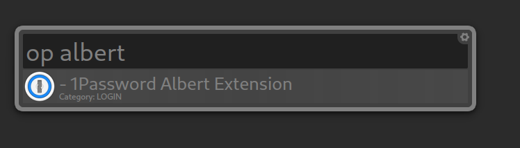
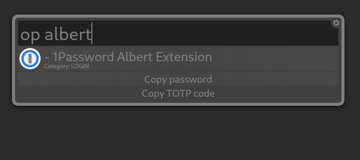
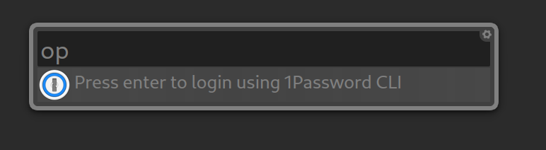

# 1Password Albert
An [Albert](https://albertlauncher.github.io/) extension to search for 1Password password items and copy there respective password or TOTP code.

## Usage

This extension allows you to search through your 1password account  
and copy the password or the 2FA code from the items.

By default it copies the password but if you need more actions you can use the alternative actions key  
(Default is  <kbd>Alt</kbd>) 

## Authentication

### Through 1Password Desktop
When the default desktop application can connect to the CLI it will prompt for the system password when Albert starts with this extension enabled.

To enable this in 1Password:
1. Open settings
2. Open Developers
3. Enable CLI connect.  
  

### Without Desktop Client or CLI connect disabled
This extension still works if the desktop application is not installed or the CLI is not connected.  
It uses a Session token given by the 1Password CLI for the authentication.  
When the extension is started for the first time it will check for this token and see if it is still valid.

If it's not valid it won't retrieve items and will show an action to login using the CLI.  
This will request a native CLI login which generates a token that we can use to authenticate.  
The token is saved in the extensions installation directory in the `.sessionToken` file.

## Features

For now only the Password or 2FA can be copied.

- [x] Copy Password
- [x] Copy 2FA
- [ ] Copy Username
- [ ] Copy Notes
- [ ] Sync option

